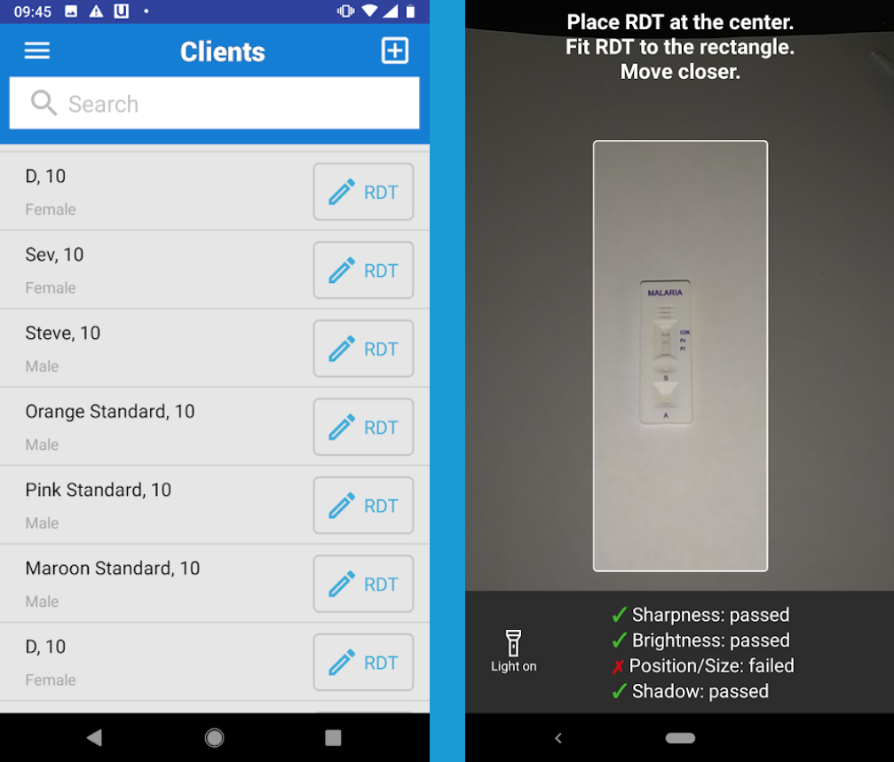
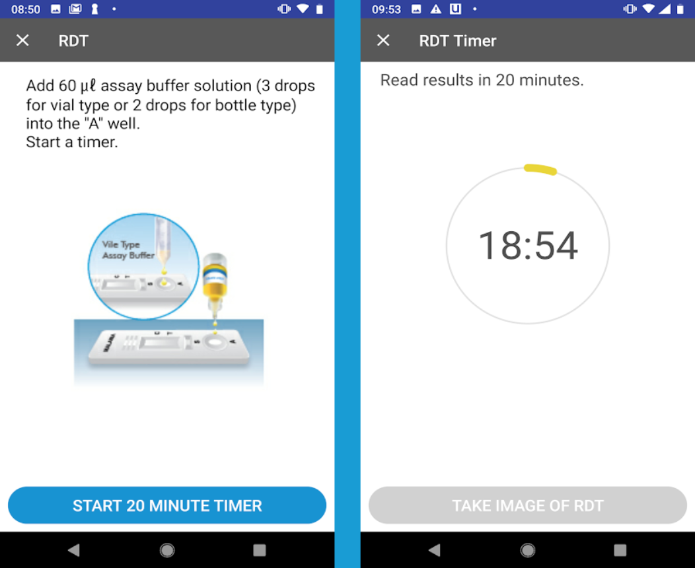
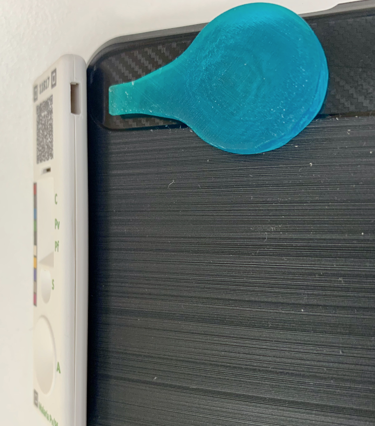

  

## OpenRDP - Open Rapid Diagnostic Platform

- Register Patients & Devices: Use machine learning to read RDTs and link with patient data

- Choreograph Testing: Ensure safe testing protocols and minimize errors

- Lab Integration: Precision public health surveillance connects the lab to the community

## Getting Started
These instructions will get you a copy of the project up and running on your local machine for development and testing purposes. See deployment for notes on how to deploy the project on a live system.

## Prerequisites
[Tools and Frameworks Setup](https://smartregister.atlassian.net/wiki/spaces/Documentation/pages/6619207/Tools+and+Frameworks+Setup)

## Development setup

### Steps to set up:
[OpenSRP android client app build](https://smartregister.atlassian.net/wiki/spaces/Documentation/pages/6619236/OpenSRP+App+Build)

### Running the tests

[Android client unit tests](https://smartregister.atlassian.net/wiki/spaces/Documentation/pages/65570428/OpenSRP+Client)

## Deployment
[Production releases](https://smartregister.atlassian.net/wiki/spaces/Documentation/pages/1141866503/How+to+create+a+release+APK)

## Features

- Patient registration
- RDT reading
- RDT choreography
- Result integration

## Versioning
We use SemVer for versioning. For the versions available, see the tags on this repository.
For more details check out https://semver.org/

## Authors/Team
* The Ona team
* The University of Washington Ubicomp Lab

## Contributing
[Contribution guidelines](https://smartregister.atlassian.net/wiki/spaces/Documentation/pages/6619193/OpenSRP+Developer+s+Guide)

## Documentation
Wiki https://smartregister.atlassian.net/wiki/spaces/Documentation

## Support
Email: support@ona.io
Slack workspace: opensrp.slack.com

## License
This project is licensed under the Apache 2.0 License - see the [LICENSE](LICENSE) file for details, and copyright Ona Systems, Inc.
